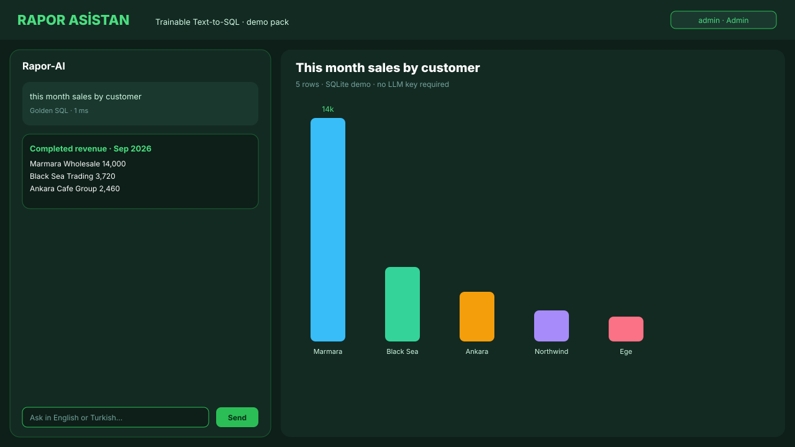
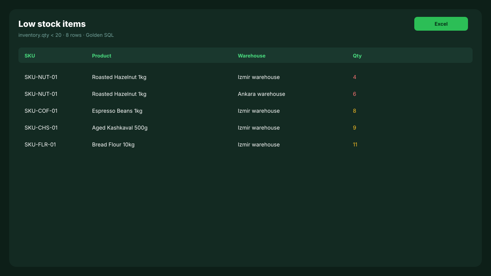
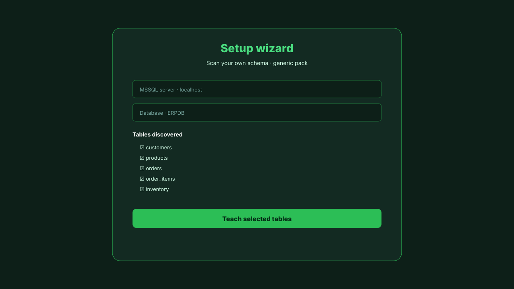
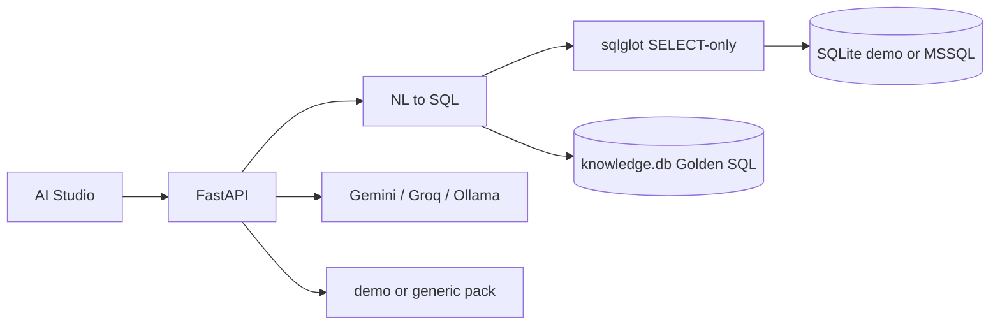

# Rapor Asistan

Trainable **Text-to-SQL reporting cockpit**. Connect any database, teach the schema in the wizard, ask in natural language, get a live table + chart.

Clone → run → ask. No MSSQL required for the demo.

[](https://github.com/celaltokmak61/rapor-asistan/actions/workflows/ci.yml)
[](LICENSE)

## 60-second demo

```bash
docker compose up --build
```

Open [http://localhost:8000](http://localhost:8000)

<p align="center">
  
</p>
<p align="center">
  
  
</p>

```
admin / admin123
```

Try the chips or type:

- `this month sales by customer`
- `top products by revenue`
- `low stock items`
- `revenue by category`

Those four hit **Golden SQL** (no LLM key). Add `GEMINI_API_KEY` or `GROQ_API_KEY` in `.env` for free-form questions.

Without Docker:

```bash
python -m pip install -r backend/requirements.txt
python backend/app/packs/demo/data/build_demo_db.py
cd backend
set PYTHONPATH=.
python -m uvicorn app.main:app --host 0.0.0.0 --port 8000
```

Windows: `KOKPIT_BASLAT.bat`

## Why this exists

Most Text-to-SQL demos hallucinate columns. This one does three things first:

1. **Discover** live tables (`INFORMATION_SCHEMA` / SQLite catalog)
2. **Teach** rules in Turkish or English (“active rows are `status = 1`”)
3. **Pin** approved question → SQL pairs (Golden SQL, ~1 ms)

Then the model is allowed to invent SQL — still SELECT-only, AST-checked with [sqlglot](https://github.com/tobymao/sqlglot).

## Architecture



Details: [docs/ARCHITECTURE.md](docs/ARCHITECTURE.md)

## Packs

| `ACTIVE_PACK` | Use |
| --- | --- |
| `demo` (default) | Bundled commerce SQLite. Clone and ask. |
| `generic` | Your ERP. Wizard scans tables, you teach the rest. |

New ERP = copy `backend/app/packs/generic`, write `pack.py` + `prompt.py`. Keep table names out of the core.

## Use your own database

```env
ACTIVE_PACK=generic
DB_BACKEND=mssql
SQL_DIALECT=tsql
MSSQL_SERVER=localhost
MSSQL_DATABASE=ERPDB
MSSQL_USER=
MSSQL_PASSWORD=
```

Restart, complete the setup wizard, teach 3–5 Golden SQL examples.

## Tests

```bash
python -m pip install -r backend/requirements.txt
python backend/app/packs/demo/data/build_demo_db.py
cd backend
python -m pytest tests -q
```

CI runs compile + pytest on every PR.

## Security

- SELECT only (sqlglot AST + keyword denylist)
- `.env` and `knowledge.db` are gitignored
- Change `admin / admin123` before any network bind
- Prefer a read-only SQL login in production

[SECURITY.md](SECURITY.md) · [CONTRIBUTING.md](CONTRIBUTING.md) · MIT
